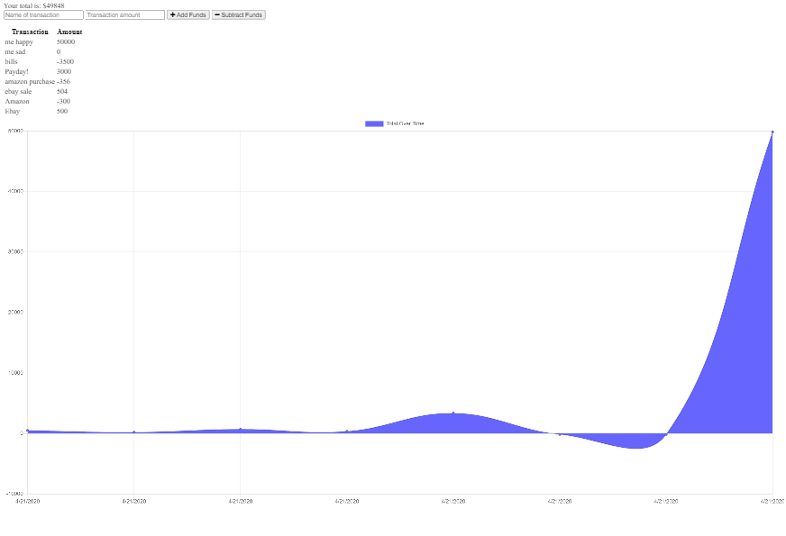

# Budget Tracker - Portable Web App
Homework assignment to create a PWA that allows you to track your budget offline.

## User Story
As an avid traveller, I want to be able to track my withdrawals and deposits with or without a data/internet connection so that my account balance is accurate when I am traveling.

## Business Context
Giving users a fast and easy way to track their money is important but allowing them to access this information anytime is even more important. Having offline functionality is paramount to our application's success. 

## Instructions
To run the app, follow these instructions:
* Fork the repo and run it from terminal using NPM start
* Open a browser and navigate to localhost:8080

The app should look something like this: 

